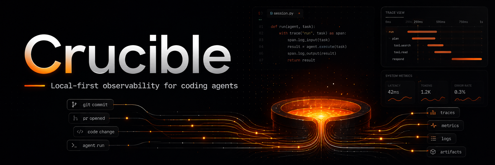
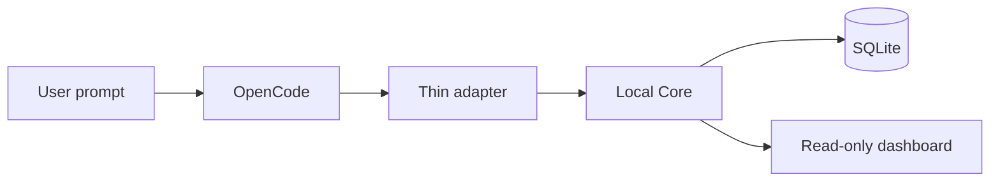

# Crucible

<p align="center">
  
</p>

**Local-first observability and tracking for coding-agent work.**

<p align="center">
  
  
  
</p>

Crucible is a companion layer for agent-assisted development. It observes a coding agent's work, captures the effective Git state before and after each unit of work, and keeps a local, inspectable history.

> A coding environment should get better the more you use it.

Crucible is not an IDE, coding agent, AI model, prompt proxy, or replacement for [OpenCode](https://opencode.ai/). OpenCode remains the environment where work happens. Crucible records that work and, in later milestones, will use that history for deterministic validation, reviews, correction tracking, learnings, and rules.

> **MVP focus:** trustworthy Git attribution per agent Task. Crucible skips tracking when it cannot establish a safe baseline and boundary.

## Target MVP Stack

The following is the **planned** stack. These components are not implemented in this repository yet.

<p>
  
  
  
  
  
  
</p>

## Status

This repository currently contains the architecture and MVP design. The implementation packages, installable CLI, OpenCode adapter, FastAPI Core, and Angular dashboard have not been created yet.

The first implementation milestone is deliberately narrow: reliably track one OpenCode Task, persist its isolated Git diff in local SQLite, and display it read-only in a dashboard. Features described as **Future** are not available in the MVP.



## Contents

- [What Crucible Tracks](#what-crucible-tracks)
- [Architecture](#architecture)
- [Domain Model](#domain-model)
- [Task Lifecycle](#task-lifecycle)
- [Git Tracking](#git-tracking)
- [Concurrency and Boundaries](#concurrency-and-boundaries)
- [Project Initialization](#project-initialization)
- [Core API and Storage](#core-api-and-storage)
- [Dashboard](#dashboard)
- [Planned CLI and Local Development](#planned-cli-and-local-development)
- [Privacy and Security](#privacy-and-security)
- [Recovery and Git Object Availability](#recovery-and-git-object-availability)
- [Testing and OpenCode Compatibility](#testing-and-opencode-compatibility)
- [MVP Limitations](#mvp-limitations)
- [Roadmap](#roadmap)
- [Contributing](#contributing)

## At A Glance

| Boundary | MVP decision |
| --- | --- |
| Unit of tracking | One user instruction becomes one Task, not one whole Session. |
| Source of truth | The Core owns Git snapshots, reconciliation, lifecycle, and SQLite. |
| Safety rule | One active Task per physical working tree. |
| Failure behavior | Continue OpenCode; skip telemetry rather than attribute a diff incorrectly. |
| Data location | Per-user local SQLite, outside observed repositories. |
| Current maturity | Architecture and MVP design only; no executable packages yet. |

## What Crucible Tracks

The MVP tracks a **Task**: a unit of work initiated by one user instruction to a coding agent. It records enough state to answer questions such as:

- Which OpenCode Session and user instruction produced this work?
- Which Project and physical working tree were involved?
- What was the branch, HEAD, and effective Git state before the agent ran?
- What was the effective state when the Task ended?
- Which files changed, and what was the isolated Task Diff?

Crucible does not call an AI model in this milestone. It does not run validations, review code, modify source files, or send repository data to an external service.

## Architecture

Crucible is a monorepo with independent TypeScript and Python environments:

```text
crucible/
├── packages/
│   ├── opencode-plugin/  OpenCode adapter
│   ├── cli/              Local CLI
│   └── sdk/              TypeScript contracts and HTTP client
├── dashboard/            Angular dashboard
└── core/                 FastAPI, SQLite, migrations, Git integration
```

`pnpm workspaces` will manage only the TypeScript packages and dashboard. `core/` will remain an independent Python project with its own `pyproject.toml`, environment, dependencies, and migrations. The TypeScript and Python sides communicate through versioned local HTTP/JSON contracts.

The MVP intentionally does not use Nx, Turborepo, Docker, Celery, RabbitMQ, Redis, or another monorepo/job-management layer.

### Components

| Component | Responsibility | Does not do |
| --- | --- | --- |
| OpenCode adapter | Observes OpenCode, identifies Tasks, sends normalized lifecycle events | Git snapshots, diff calculation, AI calls, starting the Core |
| Core | Domain lifecycle, Git capture/reconciliation, SQLite, idempotency, API, dashboard hosting | Depend on OpenCode-specific idle/busy semantics |
| Dashboard | Read-only Task history and detail | Edit Tasks or act as an IDE |
| CLI | Initialize a Project and operate the local Core | Start automatically from the plugin |

### Passive-first behavior

Crucible is designed to be passive-first. Its adapter hot path observes and forwards events quickly. Core failures must not interrupt OpenCode or prevent a developer from continuing work.

Some short synchronous handshakes are necessary to establish a correct Git boundary. If Crucible cannot complete one within its deadline, it sacrifices tracking rather than blocking OpenCode or recording an ambiguous diff.

### OpenCode adapter

The OpenCode adapter is intentionally thin. It will:

- observe required OpenCode lifecycle events;
- detect user instructions and OpenCode Sessions;
- use the initiating user `MessageID` as a Task `execution_id` when available;
- resolve the physical `git_root`;
- validate `.crucible/project.json`;
- send normalized local HTTP events;
- apply OpenCode-specific idle stabilization and Task-boundary logic;
- maintain a bounded local outbox for retries of accepted Task events and diagnostics.

It will not calculate Git diffs, capture Git snapshots, write operational data into a repository, initialize a Project, start the Core, run validations, or call a model.

The initial adapter supports only explicitly tested OpenCode V2 releases. It requires capabilities such as the prompt hook, `message.updated`, user `MessageID`, assistant `parentID`, Session identity, and working-tree data. Missing capabilities disable Crucible tracking with `INCOMPATIBLE_OPENCODE`; they never degrade OpenCode itself. There are no silent heuristic fallbacks for older APIs.

### Core

The Core is the domain authority. It creates and transitions Tasks, captures Git state, persists history, enforces per-working-tree exclusivity, processes idempotent events, and serves both the HTTP API and compiled Angular dashboard.

The planned default listener is local only:

```text
http://127.0.0.1:7331
```

It must not bind to `0.0.0.0` in the MVP.

## Domain Model

### Project

A Project is the logical Crucible identity for a repository. Its canonical UUID lives in a versioned file:

```text
.crucible/project.json
```

Repository name, remote URL, and local paths are metadata, not identity. Versioning `project.json` lets clones and Git worktrees on branches containing that file share the same Project identity. Crucible never searches another worktree, copies this file, or infers identity from a remote URL or path.

### Working Tree

A Working Tree is one physical normalized `git_root`. A Project can have many working trees:

```text
Project PRISMA
├── /repos/prisma
└── /repos/prisma-auth-worktree
```

Git state and Task diffs belong to a Working Tree, not to a Project globally. The MVP allows one active Task per `git_root`; different worktrees are independent.

### Session

A Session is a continuous coding-agent conversation. One OpenCode Session can contain multiple Tasks.

```text
OpenCode Session
├── Task: create the endpoint
├── Task: add pagination
└── Task: fix the tests
```

### Task

A Task is one unit of work initiated by a user instruction. It has its own Crucible identifier, Git baseline, final snapshot, and isolated Task Diff.

For OpenCode, the normal identity is:

```text
execution_id = initiating user MessageID
```

`event_id` is different: it identifies an HTTP event delivery for retries and idempotency. Prompt text is stored only when available and is never used as an identity.

## Task Lifecycle

```text
running
  -> finalizing
  -> completed

running
  -> finalizing
  -> failed
```

| State | Meaning |
| --- | --- |
| `running` | The Core captured and persisted a trustworthy Git baseline. |
| `finalizing` | Completion was received and the Core is freezing or materializing the final state. |
| `completed` | Final state, file changes, and Task Diff are persisted; the result no longer depends on the mutable working tree. |
| `failed` | Crucible could not complete tracking correctly. This does not mean the agent's code is functionally incorrect. |

`tracking_skipped` is not a Task state. When a baseline cannot be captured safely, Crucible creates no Task and records an adapter/tracking diagnostic instead. Examples include a Core timeout, an uninitialized Project, invalid configuration, an overlapping execution, incompatibility, or an unidentifiable instruction.

## Git Tracking

A plain `git diff` is not enough. A working tree can already be dirty before an agent starts. An agent can also create or delete files, stage changes, commit, and advance `HEAD`. Crucible therefore compares the **effective initial state** with the **effective final state**.

### Baseline

Before the prompt enters the normal agent workflow, the OpenCode prompt hook performs a short `task_started` handshake. The Core creates the Task and persists its baseline before returning success.

The baseline includes:

- `baseline_head` and branch;
- NUL-delimited `git status --porcelain=v1 -z --untracked-files=all` information, including `XY` status;
- tracked files already dirty at Task start;
- untracked, non-ignored files already present at Task start.

Git-ignored files are out of scope in the MVP. Clean tracked files are not copied into SQLite: their initial content can be reconstructed temporarily from `<baseline_head>:<path>`. Initially dirty tracked files and pre-existing untracked files retain their status, hash, and compressed textual content in SQLite.

For text within the configured limit, Crucible stores hash, size, status, and compressed content. For binary files or larger files, it stores only applicable metadata and hashes.

The initial limit is:

```yaml
tracking:
  max_snapshot_file_size_bytes: 1048576
```

### Final capture and materialization

At Task completion the Core captures `final_head`, final branch, and all final state needed to preserve the result. It immediately freezes a `task_file_changes` record for every path that diverges from the baseline, including final status, hash, size, and bounded textual content where appropriate.

After this critical snapshot is persisted, later materialization derives operations such as `added`, `modified`, and `deleted`, rename metadata, per-file patches, and the aggregate `tasks.task_diff`. It never rereads the mutable working tree.

Advancing `HEAD` on the same branch is allowed and committed agent changes are included in the effective content transformation. A branch identity change is not safely attributable and fails tracking with `BRANCH_CHANGED_DURING_TASK`. HEAD movement is recorded separately and can exist even when the content diff is empty.

## Concurrency and Boundaries

The MVP permits at most one active Task per physical working tree:

```text
1 Task in running or finalizing per git_root
```

The Core enforces this atomically in SQLite with a partial unique index. If another execution starts in the same worktree, the Core returns `overlapping_execution`; the adapter records a diagnostic and OpenCode continues normally. This avoids assigning concurrent changes to the wrong Task.

Parallel Tasks in separate Git worktrees are not blocked. Safe parallelism in the same worktree is a future concern.

### Idle stabilization

An OpenCode Session can remain open after a Task ends. The adapter treats idle as a completion candidate and uses a stabilization window:

```yaml
tracking:
  idle_stabilization_seconds: 10
```

New activity during the window cancels completion. If no activity occurs, the adapter submits `task_completed` asynchronously.

A new prompt while the previous Task is already in stabilization is an explicit boundary. The prompt hook holds the new prompt for at most two seconds and preserves this order:

```text
freeze final snapshot of Task A
-> capture baseline of Task B
-> release prompt B
```

If the safe boundary cannot be established inside that total budget, OpenCode continues and the new execution is `tracking_skipped`. If Task A's critical final snapshot was not frozen, it fails with `FINAL_SNAPSHOT_TIMEOUT`; Crucible must not continue reading that worktree after prompt B is released. If Task A is still actively busy, there is no safe boundary in the MVP and the new execution is not tracked.

Crucible prefers losing telemetry over storing an incorrect history.

## Project Initialization

Tracking requires explicit initialization. The planned command is:

```bash
crucible init
```

It creates versioned project files without staging or committing them:

```text
.crucible/
├── project.json
└── config.yaml
```

`project.json` contains only the canonical Project identity:

```json
{
  "project_id": "UUID"
}
```

The initial configuration is:

```yaml
version: 1

tracking:
  idle_stabilization_seconds: 10
  max_snapshot_file_size_bytes: 1048576
```

`crucible init` will be idempotent and must never replace a valid existing UUID. The OpenCode adapter is read-only with respect to the repository: it never creates `.crucible/`, generates a Project ID, or modifies `.gitignore`.

The Core validates configuration at Task start. Missing optional values receive defaults. Invalid supplied values make the Project untrackable with `INVALID_PROJECT_CONFIG` but never block OpenCode.

## Core API and Storage

The planned local API is:

```text
POST /v1/events
GET  /v1/tasks?limit=&cursor=
GET  /v1/tasks/{task_id}
GET  /v1/health
GET  /v1/status
GET  /
```

`POST /v1/events` receives adapter-neutral normalized events such as `task_started` and `task_completed`. Its envelope includes `event_id`, event type, UTC time, adapter and version, agent Session identifier, Project ID, Git root, optional workspace path, optional model/prompt, and payload version.

The Core treats a repeated `event_id` with the same payload as a normal retry. Reusing the same ID with a different payload returns `409 IDEMPOTENCY_CONFLICT`.

Task listing is cursor-paginated and ordered by descending start time. A Task detail response contains all data required by the dashboard. Errors use `application/problem+json` with stable Crucible codes, including:

- `overlapping_execution`
- `INVALID_PROJECT_CONFIG`
- `PROJECT_NOT_INITIALIZED`
- `IDEMPOTENCY_CONFLICT`
- `BRANCH_CHANGED_DURING_TASK`
- `BASELINE_OBJECT_UNAVAILABLE`

The Angular application is served at `/` with SPA fallback. Unknown `/v1/*` paths are always API errors, never dashboard routes.

### SQLite

Crucible uses one persistent SQLite database per operating-system user, outside repositories. The exact location is resolved through a platform-aware application-data library. Expected locations include:

```text
Linux:   ~/.local/share/crucible/
macOS:   ~/Library/Application Support/Crucible/
Windows: %LOCALAPPDATA%\Crucible\
```

The initial schema is created only through migrations and includes:

- `projects`
- `working_trees`
- `sessions`
- `tasks`
- `task_baseline_files`
- `task_file_changes`
- `inbound_events`

`projects` represents the logical UUID identity. `working_trees` represents a physical Git root and is unique by `git_root`. `sessions` is unique by `(adapter, agent_session_id)`. `tasks` is unique by `(session_id, execution_id)`.

No operational data, diffs, logs, or SQLite files are written inside an observed repository.

## Dashboard

The MVP dashboard is read-only:

```text
/            -> /tasks
/tasks
/tasks/:id
```

`/tasks` provides simple pagination and descending start order, showing status, Project, worktree, branch, OpenCode execution identity, and timestamps.

`/tasks/:id` shows Task and Session metadata, agent Session ID, execution ID, prompt/model when available, baseline and final HEAD, branch, Git root, workspace path, changed files, Task Diff, and any tracking failure diagnostic.

The MVP does not include editing, metrics, charts, advanced filters, SSE, validation, AI review, learnings, or rules.

## Planned CLI and Local Development

The following CLI interface is part of the MVP design but is **not implemented in this repository yet**:

```bash
crucible init
crucible serve
crucible dashboard
crucible status
```

| Command | Planned behavior |
| --- | --- |
| `crucible init` | Resolve Git root and create `.crucible/project.json` and `.crucible/config.yaml`. |
| `crucible serve` | Run the FastAPI Core in the foreground and serve the Angular build on `127.0.0.1:7331`. |
| `crucible dashboard` | Probe the Core and open `http://127.0.0.1:7331`; explain how to start it if offline. |
| `crucible status` | Report Core availability, address, SQLite path, migration revision, and the Project associated with the current directory when applicable. |

The plugin never starts the Core. Daemonization, systemd, Windows Services, and launchd integration are intentionally outside the MVP.

There are no install or run commands yet because no executable package has been published or committed. Until implementation lands, use this README as the technical contract rather than a setup guide.

## Privacy and Security

Crucible is local-first. In the MVP it can store prompts, diffs, source code, snapshots, and existing working-tree data in the local SQLite database. Those contents can include secrets.

- No tracked content is sent to an external service.
- There is no external analytics, AI reviewer, or model call.
- The Core listens only on `127.0.0.1` and uses the local operating-system user as its initial trust boundary.
- Crucible does not provide automatic redaction, encryption, or retention controls in the MVP.
- Binary files and files over the snapshot limit retain metadata and hashes rather than raw content.
- The implementation should apply reasonable local filesystem permissions where supported.

Treat the Crucible SQLite database as a sensitive local file.

## Recovery and Git Object Availability

The Core writes `snapshot_frozen_at` in the same transaction as the critical final snapshot. An internal idempotent worker materializes frozen `finalizing` Tasks. On startup, the Core resumes those Tasks without an external queue or job table.

```text
finalizing + snapshot_frozen_at
-> resume materialization
```

A `finalizing` Task without a frozen snapshot fails rather than recapturing a now-mutable working tree. Materialization uses SQLite and immutable Git objects referenced by `baseline_head` and, when needed, `final_head`; it never rereads the worktree.

To avoid copying every clean tracked file, Crucible temporarily depends on required Git objects being available while a Task is `finalizing`. A rewrite followed by aggressive garbage collection can remove an object before materialization. In that case tracking fails with `BASELINE_OBJECT_UNAVAILABLE` or an equivalent structured failure. Once a Task is `completed`, persisted file changes, patches, and Task Diff no longer depend on Git object availability.

## Testing and OpenCode Compatibility

Normal CI will run unit tests and simulated adapter/Core integration tests covering lifecycle transitions, event idempotency, Git reconciliation, and recovery behavior.

An opt-in compatibility test named `opencode-live` will exercise the real OpenCode integration:

- temporary Git repository;
- real OpenCode process and Crucible adapter/Core;
- deterministic local mock HTTP provider;
- predictable tool call that changes a known file;
- no external provider and no real credentials.

Its primary assertion is ordering: Crucible must persist the baseline before OpenCode performs the first real file change. `noReply` behavior is not a substitute because it does not execute the agent loop.

`opencode-live` is excluded from normal CI and runs locally or in an explicitly prepared compatibility workflow. OpenCode support is documented only after this workflow tests it:

| OpenCode version | Crucible adapter version | Status |
| --- | --- | --- |
| Not established yet | Not established yet | No supported version declared |

## MVP Limitations

- One active Task per working tree; concurrent changes in the same worktree are not attributed.
- No AI calls, validation engine, reviewer, correction loop, learning system, rule engine, or skills analytics.
- No cloud sync, external telemetry, or multi-user/network API.
- No automatic redaction, Crucible-managed encryption, or retention policy.
- Temporary dependency on Git objects while a Task is finalizing.
- OpenCode support is limited to releases explicitly tested by `opencode-live`.
- The current repository is design-only; the MVP implementation has not been committed yet.

## Roadmap

Future milestones, without dates or commitment order:

1. Deterministic validation engine.
2. Optional AI reviewer using the developer's existing agent/provider setup.
3. Correction tracking against later developer changes.
4. Learning classification and reviewable learnings.
5. Project rules with evidence and approval.
6. Skills analytics and improvement suggestions.
7. Selective context engine.
8. Safe parallelism through isolated worktrees.
9. Retention, redaction, and encryption controls.
10. Adapters for additional coding agents.

These are future work, not MVP capabilities.

## Contributing

Contributions are welcome once implementation begins. Please open an issue before proposing large architectural changes.

Contributions should preserve the following constraints:

- Keep the adapter thin and OpenCode-specific behavior isolated from the Core domain.
- Preserve passive-first behavior; Crucible must not become a source of development interruption.
- Do not add AI work to the adapter hot path.
- Prefer deterministic Git, filesystem, and validation mechanisms before model calls.
- Add lifecycle and tracking tests for behavior changes.
- Verify OpenCode adapter changes against current OpenCode documentation and source; run `opencode-live` when the change affects supported capabilities or event ordering.

## License

No license has been selected yet.
