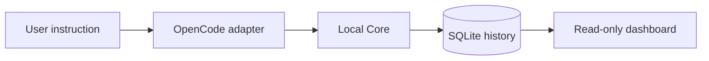

<p align="center">
  
</p>

<h1 align="center">Crucible</h1>

<p align="center">
  <strong>Every agent task. A traceable code change.</strong><br>
  Local-first code provenance for agent-assisted development.
</p>

<p align="center">
  
  
  
  
  
</p>

<p align="center">
  <a href="#overview">Overview</a> ·
  <a href="#how-it-works">How it works</a> ·
  <a href="#getting-started">Getting started</a> ·
  <a href="#roadmap">Roadmap</a> ·
  <a href="#contributing">Contributing</a>
</p>

---

## Overview

Coding agents can change dozens of files in a single conversation. Understanding which instruction produced which change becomes harder when a repository already has uncommitted work or the agent creates commits along the way.

**Crucible is being built to connect each user instruction to the exact repository changes produced during that task.** It runs alongside your coding environment, with OpenCode as the first planned integration, and keeps the resulting history on your machine.

The goal is simple: make agent-written code easier to inspect, understand, and improve over time.

> **Early development.** Project initialization and the local API/database foundation are implemented. Agent integration, Git task capture, and the dashboard are still planned; end-to-end tracking is not available yet.

## How it works

The planned tracking flow follows one task from instruction to reviewable diff:



1. **Capture the starting point.** Record the effective Git state before the agent begins, including existing uncommitted changes.
2. **Observe the task.** Associate the execution with its instruction, session, project, and working tree.
3. **Freeze the result.** Compare the final state with the baseline to isolate the task's changes, including changes committed by the agent.
4. **Inspect the history.** Browse task metadata, changed files, and diffs in a local dashboard.

The design prioritizes reliable attribution: one active task per physical working tree, with tracking skipped when a safe boundary cannot be established. Separate Git worktrees can be tracked independently.

### Design principles

- **Task-level history.** Each instruction gets its own baseline and diff within a larger agent conversation.
- **Local-first storage.** Repository history stays in a per-user SQLite database outside the observed repository.
- **Uninterrupted development.** Tracking failures should let the agent continue working.
- **Deterministic foundations.** The MVP is designed around Git and local storage, with no AI calls or external telemetry.

## Project status

| Component | Available today | Planned next |
| --- | --- | --- |
| **CLI · TypeScript** | `init`: create and validate project identity and configuration | `serve`, `dashboard`, and `status` commands |
| **Core · FastAPI** | Health/status API, SQLite migrations, project validation | Task lifecycle, event ingestion, Git snapshots, and isolated diffs |
| **OpenCode adapter** | Not implemented | Task detection and lifecycle events |
| **Dashboard · Angular** | Not implemented | Read-only task history and diff inspection |

## Getting started

This is a **source development setup** for the current foundation. You will need Git, a recent Node.js version (22+ recommended), pnpm **10.33.2**, and Python **3.12+**.

### 1. Build the CLI

From the repository root:

```sh
pnpm install
pnpm build
```

Initialize an existing Git repository:

```sh
node packages/cli/dist/index.js init /path/to/your/repository
```

This creates two files at the target repository's Git root:

```text
.crucible/
├── project.json    # Stable project UUID, shared through version control
└── config.yaml     # Tracking configuration
```

Initialization preserves an existing valid project ID and configuration. Files are created without being staged or committed. Initialization alone does not enable agent tracking.

### 2. Start the local Core

From the repository root, create a Python environment:

```sh
python -m venv core/.venv
```

Activate it using the command for your shell:

| Shell | Command |
| --- | --- |
| macOS / Linux (bash or zsh) | `source core/.venv/bin/activate` |
| Windows (PowerShell) | `.\core\.venv\Scripts\Activate.ps1` |

Install the Core and start the server:

```sh
python -m pip install -e "./core[dev]"
crucible-core
```

The server listens at **`http://127.0.0.1:7331`** and applies database migrations on startup.

| Endpoint | Purpose |
| --- | --- |
| [`GET /v1/health`](http://127.0.0.1:7331/v1/health) | Service health and version |
| [`GET /v1/status`](http://127.0.0.1:7331/v1/status) | Database path, migration revision, and runtime status |

The database uses your operating system's application-data directory by default. Set `CRUCIBLE_DATA_DIR` before starting the server to choose a different location. The dashboard is not served yet.

## Development

The repository keeps TypeScript and Python in separate environments:

```text
crucible/
├── packages/cli/       # TypeScript CLI and initialization tests
├── core/
│   ├── src/            # FastAPI service, schemas, and migrations
│   └── tests/          # API, database, and project validation tests
├── CODE_STYLE.md       # Contributor coding conventions
└── pnpm-workspace.yaml
```

Run the checks from the repository root, with the Python environment activated:

```sh
# TypeScript
pnpm typecheck
pnpm test

# Python
python -m pytest core/tests
python -m ruff check core
python -m ruff format --check core
```

## Roadmap

- [x] Project initialization with a persistent UUID and validated configuration.
- [x] Local Core with health/status endpoints and SQLite migrations.
- [ ] Task lifecycle and reliable Git baseline/final-state capture.
- [ ] OpenCode adapter with verified task boundaries.
- [ ] Read-only dashboard for task history and diffs.
- [ ] CLI commands for running and inspecting the local service.

Longer term, the project aims to support deterministic validation, optional AI reviews, correction tracking, and evidence-backed project rules. These are future directions, not current capabilities.

## Contributing

Contributions are welcome. Open an issue to discuss substantial changes, follow [the coding conventions](CODE_STYLE.md), and include relevant tests with behavior changes.

Keep agent-specific logic in adapters and lifecycle, Git, and storage logic in the Core. Changes should preserve reliable attribution and keep tracking failures from interrupting development.

## License

A license has not been selected yet.
